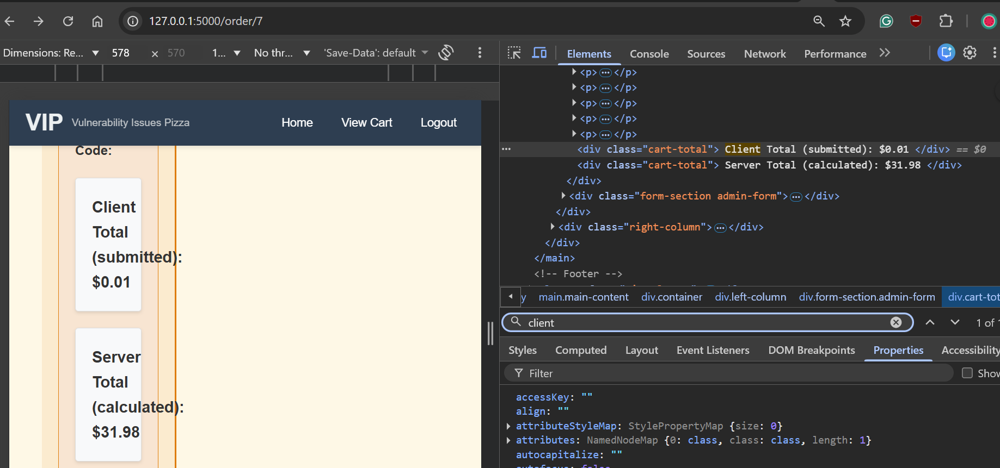
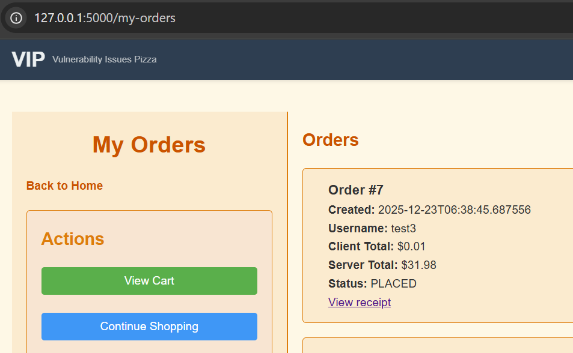
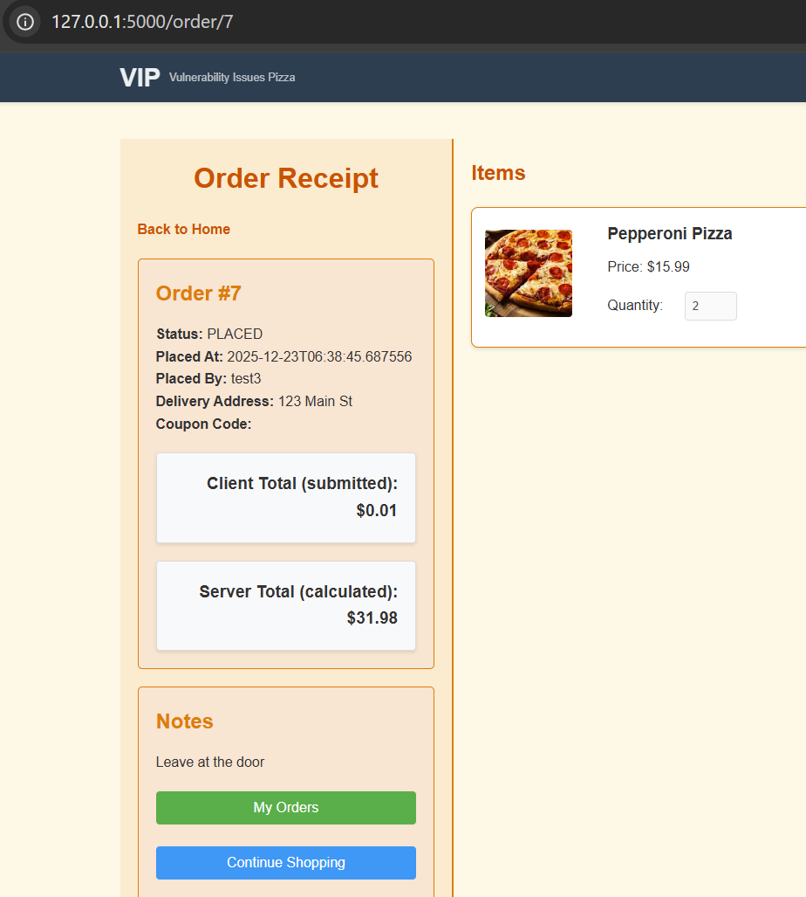

# SAMPLE_REPORT_TEMPLATE.md — VIP Pizza Security Testing Report (Student)

This is an example of a filled-out report using the structure in `REPORT_TEMPLATE.md`.

**Assumed local URL:** `http://127.0.0.1:5000`

---

# Part A — Executive Summary (5–10 lines)

## Summary
- **App tested:** VIP Pizza (local Flask app)
- **Date tested:** 2025-12-23
- **Tester name:** Test Student
- **Total vulnerabilities tested:** 8 (minimum)
- **Total confirmed (with evidence):** 1 (sample only)
- **Highest severity confirmed:** High

## Most impactful findings (top 3)
1. Client-side total tampering (price manipulation / parameter tampering)
2. (example) IDOR on order receipts
3. (example) Stored XSS in order notes

---

# Part B — Vulnerability Findings (Repeat this section for each finding)

## Finding #01 — Client-Side Price Manipulation (Parameter Tampering) — Checkout Total

### 1) Vulnerability name
**Client-Side Price Manipulation / Parameter Tampering — Checkout `total` hidden field**

### 2) Category (OWASP-style)
- Insecure Design (business logic flaw)
- Broken Access Control (trust boundary failure / trusting the client)

### 3) Severity
**High**

### 4) Where is it? (endpoint + feature)
- **URL/Endpoint:** `/checkout` (and evidence visible in `/my-orders` + `/order/<id>`)
- **HTTP method:** POST
- **Parameters used (if any):** `total` (hidden form field)

### 5) Preconditions
What must be true before it works?
- logged in? which account?
  - Yes, must be logged in (example account: `test3`)
- must place an order first?
  - You must add items to cart, then reach the checkout page
- must be admin?
  - No

### 6) Steps to reproduce (numbered)
1. Log in as a normal user (example: `test3`).
2. Add items to the cart (example: 2 × Pepperoni Pizza).
3. Go to `/checkout`.
4. Open browser Developer Tools.
5. In the HTML for the checkout form, locate the hidden field: `name="total"`.
6. Change its value to `0.01`.
7. Click **Place Order**.
8. Go to `/my-orders` and open the newly created order.

### 7) Payload / input used
Write exactly what you typed or changed.
- Payload:
  - `total=0.01`
- Location used (form field name, URL parameter, etc.):
  - Hidden form input on checkout page: `<input type="hidden" name="total" id="client-total" ...>`

### 8) Evidence (screenshots/outputs)
- **Evidence A (screenshot):** DevTools Elements tab showing the hidden input `name="total"` changed to `0.01`.

- **Evidence B (screenshot):** `/my-orders` page showing the order with:
  - Client Total: `$0.01`
  - Server Total: `$31.98`

- **Evidence C (optional):** `/order/<id>` receipt showing the same mismatch.

### 9) CIA impact (tick all that apply)
- **Confidentiality:** [ ] Yes  [x] No
- **Integrity:** [x] Yes  [ ] No
- **Availability:** [ ] Yes  [x] No

### 10) Impact statement (1–2 sentences)
An attacker can tamper with the price by changing the hidden `total` field before checkout, causing the system to record a lower “client total” (e.g. `$0.01`) than the real server-calculated total (e.g. `$31.98`). This is an integrity failure that could enable underpayment/fraud in a real payment workflow.

### 11) Recommendation / fix (brief)
Do not trust the client-submitted `total`. Calculate totals server-side from authoritative product prices, ignore/validate the submitted total, and only store/charge the server-calculated amount.

### 12) Extra notes (optional)
- This is easy to exploit with DevTools and does not require special tools.
- The receipt currently shows both totals, which makes the mismatch easy to prove for testing.

---

# Part C — Recommendations Summary (short)

List 5–10 bullet points summarising the most important fixes.
- Ignore client-submitted totals; compute totals server-side only.
- Validate all numeric inputs (types and ranges).
- Add CSRF tokens to checkout POST.
- Enforce ownership checks for order receipts (`/order/<id>`).
- Use parameterized SQL queries for all DB access.

---

# Part D — Appendix (optional)

Include any extra evidence here:
- Screenshot: hidden input `total` changed to `0.01` in DevTools.
- Screenshot: `/my-orders` showing client/server total mismatch.
- Screenshot: `/order/<id>` receipt showing mismatch.

## Appendix Images

